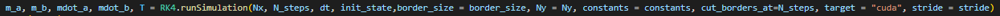

# Note
Most function in this code contains docstrings. So if you wonder what a function does type <code>print function_name. __ doc __ </code>
# Anitferromagnetic-spin-simulations
This simulation is about solving the LLG equation of the form: 

<!-- $$
\dot {\vec{m_i}} = -\frac{\gamma}{1+\alpha^2} \vec{m_i} \times \left[ \vec \tilde{H_i} + \alpha (\vec{m_i} + \vec \tilde{H_i}) \right] + \frac{1}{1+\alpha^2} \left[ \vec \tau + \alpha \vec m_i \times \vec \tau \right]\quad i = A,B\\
\vec \tau = c_1 \vec m \times \vec J + \beta_1 \vec m \times(\vec m \times \vec J) 
$$ -->

The effective hamiltian $\vec{\tilde{H_i}}$ is given by the derivative of the free energy and the thermally induced random noise $H_T$ 

<!-- $$
\vec H_i = - \frac{\delta F}{\gamma \delta \vec m} = H_{\text{Exchange}} + H_{\text{Anisotropy}} + H_{\text{Zeeman}} + H_{\text{Bulk-DMI}} + H_{\text{Edge-DMI}} + H_{\text{Temperature}} 
$$ -->
The contributions to the effective field are

The temperatures are uncorrelated noise and is given by the following: 

In the simulation tool this is implemented by sampling values from a single guassian distribution given by the above parameters at each time step for each spin on the lattice.

The purpose of the simulation is to measure the spin-current on the other side of the lattice. The quantity we wish to measure is 

<!-- $$
\langle J(t) \rangle_{out} = \alpha_{sp} \langle \vec m \times \dot {\vec m}\rangle _{\vec r}
$$ -->

This program is created by Even Aksnes Tønseth and Viroshaan Uthayamoorthy in collabortaion with Alireza Qaiumzadeh. 

# How to operate the simulation tool

Most of the program is operatored through the <code>main.py</code> function. In this file, the constants used in the simulation are given as input. In particular, at the end of the file lies a code chunk <code>if __name__ == '__main__':</code>. Within this <code>if</code> bracket, one enters all the functions that are to be run within the simulation. There are different functions in the files. We usually create the whole procedure that we want to perform in a function, and then call on said funciton in this  <code>if</code>-bracket. The underlying logic of the program is found in the <code>RK4.py</code> file while if the simulation tool is merely going to be applied to different problems one can limit the consideration to the files <code>main.py</code> and <code>utilities.py</code>. An introduction to how one can navigate these files are given in the following two sections.

In order to utilise the program the following python packages are required:
<ul>
  <li>Numpy</li>
  <li>Numba (regular version and cudatoolkit)</li>
  <li>matplotlib</li>
  <li>tqdm</li>
  <li>joblib</li>
  <li>PIL</li>
</ul>

The program can be run using both CPU and GPU. If it is to be run on a GPU it has to be a Nvidia GPU. Note that in cases where the system size is small, the GPU version is not nescesearilly faster. Note that for users running anaconda, the base version should have most of these packages. 

# Detailed explanation of the simualtion: RK4.py

Within this file, the function <code>runSimulation</code> performs the entire procedure. As can be seen, the function is essentially calling on the sub-functions <code>solver1D</code> or <code>solver2D</code> (or their CUDA versions if that is available). 

Within these functions, the <code>timeEvolution</code> function is called which is essentially a wrapper function for the Runge Kutta 4 method that is implemented to solve the LLG equations. At each iteration in this <code>for</code>-loop, the <code>timestep</code> function is called, and as indicated it essentially performs a single step of the runge kutta 4 method. To implement this, the derivative at each timestep is calculated using the <code>f </code> or <code>f2D</code> functions. This is stored in the local variable <code>f_1</code> within these functions, and the effective hamiltonian is given by the local variable <code>H_1</code>. Note that if more terms are to be added to the effective field, one would do so in this varible. As evident by this function, the following terms have been implemented:
<ul>
  <li>Exchange Energy</li>
  <li>Zeeman Energy</li>
  <li>Anisotropy</li>
  <li>BulkDMI</li>
  <li>EdgeDMI</li>
  <li>Temperature</li>
</ul>

Adding more terms would be done by creating functions with same-sized returns as these terms and adding a function call to the <code>H_1</code> variable. The other functions in the <code>rk4.py</code> file are simply implementation of the different terms involved in the effective hamiltonian. 

Now, if one wishes to implement new functions in this program, an overview of the sizes of the different terms can be of benefit. There are two primariy numpy matrices that are continually updated throughout the simulation, namely the <code>m_a</code> and <code>m_b</code> which represent the spins on the A and B sublattices respectively. For a 1D system, these matrices are of size <code>(Nx,N_steps,3)</code> while of a 2D system they are of size <code>(Nx,Ny,N_steps, 3)</code>. In other words, for a 1D system the first index indexes the lattice position, the second index indexes the timestep of the simulation while the third index represents the cartesian coordinates. The initialization of the <code>m_a</code> and <code>m_b</code> matrices are performed prior to the <code>runsimulation</code> call. The time-step dimension is primarily used to save the state of the system at each time step. To reduze memory usage, a stride-method as also been implemented in the timeEvolution function which effectively stores the stride-th system state instead of the state at each timestep. This causes the time-dimension to reduce to <code>N_steps//stride</code>. However, an important point is that the <code>timeStep</code> function, and hence also the <code>f</code> function take in the i-th timestep state of the system (<code>m_a[:,i,:]</code>, <code>m_b[:,i,:]</code>), and hence these functions take in <code>m_1</code>, <code>m_2</code> matrices of size <code>(Nx,3)</code> and return matrices of size <code>(Nx,3)</code> as well. This is also noted further in the doc-string of the functions as the sizes of the inputs and outputs are written there. 
# Main.py

For merely using the simulation tool, it suffices to operate within the <code>Main.py</code> file. In the <code>main.py</code> file, each aspect of the code can be set to different values. To navigate between each type of input, the file is seperated in sections where each section is categorized  by a comment written in capital letters. Examples of such are "SET IMPORTANT VALUES" and "SET ANISOTROPY" where the proceeding constants affect some of the core values of the simulation and the values of the anisotropy respectively. There are different ways of setting the values. In the case of important values, most are merely scalars and hence are initialized that way. In other cases such as with the initial state of the spin system, one has to initialize a <code>(Nx,N_steps,3)</code> sized array, and hence these are usually initialized by some custom functions. Examples of such functions can be found in the <code>utilities.py</code> file. In order to call on them from the <code>main.py</code> file, one writes <code>ut.functionname</code> for a function with the name "functionname" found in the <code>utilities.py</code> file. In order to operate the program, one merely follows these simple steps:

<ul>
  <li>Go through the main.py file</li>
  <li>If you want an effect, create a function and call it in the <code>main.py</code> file</li>
  <li>If you want to turn off an effect, comment it out or multiply by 0</li>
  <li>run the <code>RK4.runSimulation</code> function in the <code>if __name__ == '__main__'</code> part of the file which returns <code>m_a, m_b, mdot_a, mdot_b</code> for all times <code>T</code>. </li>
</ul>

As mentioned previously, <code>m_a</code> is a <code>(Nx,N_steps,3)</code> sized numpy array which contains all the spins at all lattice positions at all times. The array is three dimensional, where the first dimension navigates the lattice, the second navigates the time and the third dimension gives the coordinate of the spin at said lattice. For instance, if one were to find the y-component of the spin at the first lattice site at the final time, one would index the array using <code>m_a[0,-1,1]</code>.
# Utilities.py

The <code>utilities.py</code> file is meant as a storage of helpful functions that can be used to initialize different aspects needed in the simulation. For instance, the code is structed such that if one were to have an external magnetic field in the system, the magnetic field at all lattice points at all times and in all directions would have to be initialized at the start. Once this is initialized, it is passed together will all other system parameters and the simulation is performed. The file then contains multiple ways to initialize different parts of the system such as magnetic fields, gilbert damping, anisotropy and inititalizign the spins on the lattice before the simulation begins. These functions are in turn called on in the <code>main.py</code> file prior to the <code>rk4.runsimulation</code> call. 

TIPS: When working with these files, we recomend that you take a minute to minimze the functions in the editor as it makes the files more readable. The <code>utilities.py</code> file should look something like this when working with the code:

# Plotting.py

The <code>plotting.py</code> file implements some basic plotting functions that might be handy for visualization of the results. Rather than animating the results, one instead has a slider that can be moved in order to view the state of the spin system at each timestep. This plots the magnetization at discretized lattice positions as arrows. This might look like spins, however it is not spins. They are a representation of the magnetization at that lattice position. 

The most simple way to animate the figures is to call the function <code>SpinAnimationWrapper</code> function. Given the necessary arguments as given in the documentation of the function, this function will check for a 1D or 2D system and plot the system for each timestep accordingly. There are some aspects with the code that can be changed to make the plotting look nicer and run use less frames. This comes in the form of strides. As mentioned earlier, the timestep dimension is not <code>N_steps</code>, but rather <code>N_steps//strides</code>. Accordingly, the plotting will skip <code>strides</code> number of steps when "animating" the spin system. A similar logic is also implemented along the real axes where <code>steps_along_axes</code> will skip certain spins and instead plot a smaller grid. This defaults to 1 which results in the plotting of all spins. This functionality might be useful when the lattices become too large to plot all spins. Additionally, there is a boolean parameter called <code>average</code> which can be set to <code>True</code> if one wishes to take the average over small squares given by size <code>steps_along_axes x steps_along_axes</code>. 

# cudaKernels.py
The program is also able to  run the simulations in question on the GPU through numba's cuda integration in python for nvidia GPUs. The procedure is the same, but the notation differs a lot. In order to run the code in cuda, pass the argument <code>target = "cuda"</code> into the <code>runSimulation</code> function from <code>RK4.py</code>. The picture below shows the actual call to running on a GPU.  

  

# Functional methods

The newest version of the program also contains the possbility of running a functional method of the program, which is a tiny bit slower, but allows for larger systems by saving memory in runtime. This can be done on CPU and GPU in 2D and they work slightly differently as numba cuda does not allow for a large variety of datastructures. 
On CPU:
1: Create your own function for J and h in the JFunctions.py and hFunctions.py files. 
2: The functions HAVE TO HAVE the following structure:  f(m,i,h_args), where m is the magnetisation array at timestep i and args are a tuple of arguments of which can be of any form or length
3: change the constants tuple in main to the following form: constants = (w_ex, A_1, A_2, w_1, w_2, beta, C, alpha, Jfunc.yourJ,J_args, d, hfunc.yourh, h_args, D_bulk, Temp)
4: add the argument functional = True to the runSimulation call.

On GPU:
As mentioned this differs sligthly from the CPU version. As of the 30.03.2022 it is not possible to pass functions as arguments in numba cuda.
1: Modify the functions J and h in the files cudaJ and cudah respectfully. It takes arguments as a numpy array of FLOATS(have to be floats) called J_args and h_args, this is since numba cuda does not support inhomogeneuos arrays. 
2: The constants tuple has to have the same form as above, but the functional call removes the functional arguments. If no functions are present, just pass 0 in stead of Jfunc/hfunc
3: Add functional = True, target = "cuda" in runSimulation call.

# Geometries
The newest version also contains a method for creating geometries. It works by initializing an array of integer 0 or 1 and multiplying it with the initial state at the beginning. In addition to this the geometry array made has to be passed to the runSimulation call as an argument so the program can take care of the borders. It does so with Neumann boundary conditions. geometry is passed after init_state. It also contains within imageToNdarray a function which allows for any kind of png image to be reconstructed into a geometry array. It essentially works by taking 0 values where there is no "color" in the png file. By passing Nx and Ny (the runtime size of the system) the code aprroximates the structure at that size. 

# Usecase example

This example is meant as a place to easily look up syntax and how to utilise the code. If everything above was clear this part is not really nesceseary to read. It shows an example of running the code and how every constant and effective field needs to be initialised in order for it to work correctly. 
First a set of fundamental constants can be defined to simplify later constants

Now that the fundamental constants are in place, system constants can be introduced. Here they are introduced in system sizes. Later versions of the program might include SI unit conversion, but the principle should be the same. 

Some key takeaways from the above picture is that in order to run 2D, <code>L_y</code> is to be set to a non-zero number. In order to run 1D, simply set <code>L_y</code> to 0. <code>border_size</code> exist if the user wants to run a system with fixed borders. If it is non-zero the edge of the system will remain at the fixed initialized value throughout the simulation. This can be useful for looking at domain walls, for example. The overdamping length <code>od_length</code> is there if the user wants to introduce a region of overdamped dynamics at the borders of the system. This is especially useful if the user is going to exite the system with spin currents as there is a lot of backscattering from the edges if overdamping is not introduced. If the user is to include spin currens the current length gives the region of that current, it introduces to "leads" to each end of the system with the current length. <code>dt</code> and <code>N_steps</code> defines the length of the simulation and <code>stride</code> defines at how many points in time the program saves the magnetization configuration. For large systems this is nescesseary in order to not overload the computer memory.

Now that the basic runtime constants have been defined, the actual physical effective field terms can be started. For all of the terms that are not anisotropy there exists initializers in the utilities file. However it is possible to define them individually by just using the same shape as the initializers in utilities output, the program does not care if the ready-made initializers are used. Starting with damping and current, an example of initialization is shown here:

In order to see what the different parameters mean, look up the defintion in the utilities file. It should be explained in the docstring of the functions. 

Next up the magnetic field is initialized and the exchange interaction is defined. The magnetic field can also be initialized as the users want, but there are some initializers defined in utilities, which may also be used. 

Next the anisotropic constants are defined, the DMI vectors and bulk strength are defined, and the temperature is initialized. The anisotropy enters the calculations as 3x3 matrices. where the 0th index position is the x direction, 1st is y direction and 2nd is the z direction. For example setting an anisotropy in the <code>[0,0]</code> direction is equivalent to saying that there is an anisotropy along the x axis. The 3x3 matrices also allows for anisotropic interactions along axises not paralell or perpendicular to a system axis. The temperature can also be defined as the user likes, the important part is just the shape which can be found in utilities. When the user is finished defining the constants all system parameters has to be loaded into a tuple. It is imperative that the constants are loaded in the correct order. This order as well as an example of DMI, anisotropy and temperature initialization is shown below. 

Now the program is almost to run the simulation, only an initial state is required. This initial state also becomes the holding arrays for magnetisation in the program so they have to be initialized with the number of timesteps as well. If the user wishes to stride the memory as well it is here very important to remember to stride the initialization as well. Below one of the possible initializer functions are shown, the user can also define their own functions or use one of the ones in <code>utilities.py</code> as well. 

For the <code>runSimulation</code> the <code>cut_borders_at</code> gives a timestep to cut the borders if there is a border size in the system. This can be useful if one wants to first relax the system then induce dynamics. The <code>target = "cpu"</code> call says that the code should be run on the cpu, if the user wants to run it on a GPU using cuda. change "cpu" to "cuda". Also if there are unclarities in the call to run simulation look up the definition in <code>RK4.py</code>. Finally the code is ready to run, it is done in the following matter, with a call to a plotter function as well that produces the following plot

The above code results in this plot for the final timestep: 

If one wishes to process more data or show other statistics, one may use the returned m_a and m_b for other purposes as well. One example of this is the function <code>hscannew()</code> which plots the magnetization as a function of the external magnetic fields. This function performs multiple runs of the magnetic system, extracts the magnetization of the final state using different external magnetic fields and lastly plots the magnetization as a function of the external magnetic field strength. If similar implementation/usage is needed, one can refer to this function found in <code>utilities.py</code> as a guide. In this type of simulation, one creates the entire procedure that is to be simulated inside a python function, then calls on it in the <code> main.py</code> file. 

# Functionality that is not implemented yet

All the terms that is needed in the 1D and 2D magnetic systems have been implemented and tested for both CPU and GPU, however more rigirous testing of the functions can be done on the GPU side. Other optimimalizaiton measures such as dynamic shared memory might be potential avenues to increase the performance, however this is not implemented in numba.cuda yet for two dimensional arrays, and thus has not been implemented. It is possible to cast the whole problem into a 1D array, and calculate that way, but it is quite complicated. More optimization of the code is also possible. 

For very large system sizes, out approach deteriorates due to memory concerns. Particularly, since the magnetic fields, damping matrices etc. are saved and initialized at the start of the simulation, memory might be limited for the remainder of the simulations. This is not an issue with respect to the  <code> m_a, m_b</code> matirces because of striding, however since one needs each timestep of the system variables such as magnetic fields to time-evolve the system, there is a limit ot how large the matrices can be before they cannot be stored. To combat this, one may introduce a more functional programming approach to minimze memory usage or use memmap to save the matrices. This approach might be slower, but can allow for larger systems. We believe that something like 2000x2000 sized system with 200 000 timesteps will run into issues. 

Apart from this, one may also extend the simulations into 3D, however then one needs to write additional functions that allow for it, similar to how we have written 1D and 2D versions of all the terms needed for the simulations. 
